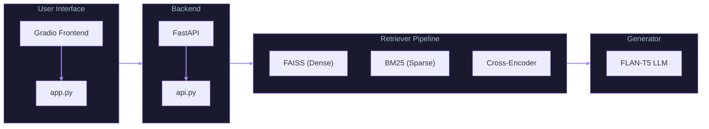
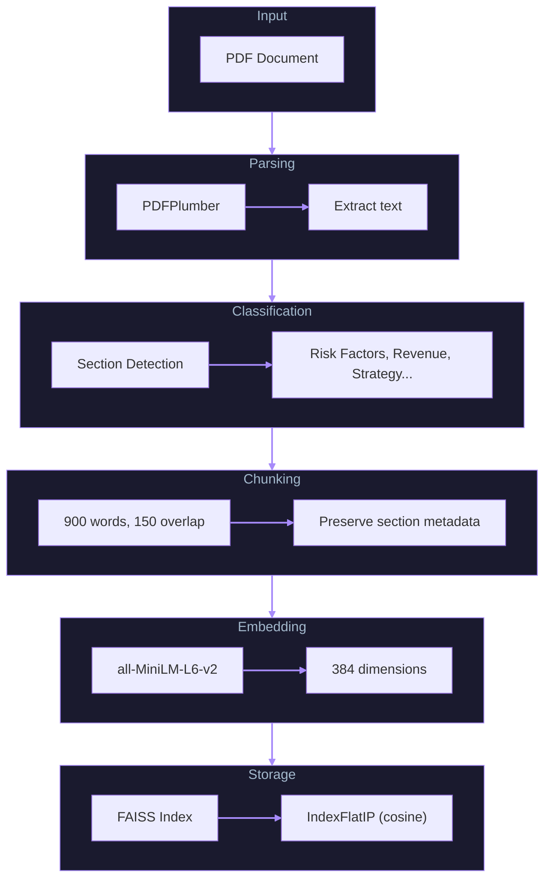
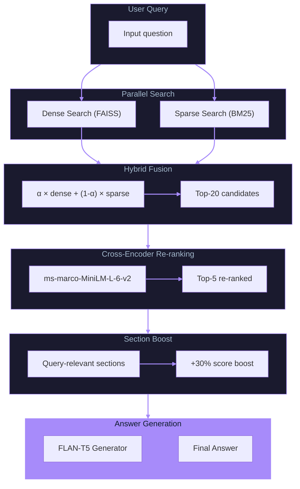

# IBM 10-K RAG System - Architecture

## System Overview



## Data Flow

### 1. Document Processing Pipeline



### 2. Query Processing Pipeline



## Component Details

### 1. Document Chunker (`src/chunker.py`)

**Purpose**: Convert PDF into searchable chunks with metadata.

**Key Design Decisions**:
- Word-based chunking (900 words) instead of character-based for semantic coherence
- 150-word overlap to prevent information loss at boundaries
- Section metadata attached to each chunk for downstream boosting

**Input**: PDF file path
**Output**: List of chunk dictionaries with `text`, `section`, `chunk_id`

### 2. Section Detector (`src/section_detector.py`)

**Purpose**: Classify 10-K sections and enable query-aware boosting.

**Sections Detected**:
- `risk_factors` - Item 1A: Risk Factors
- `revenue` - Revenue, Financial Data
- `strategy` - Business Strategy, Growth Plans
- `technology` - R&D, AI, Cloud, Quantum
- `executive` - CEO Letter, Management Discussion
- `business` - Business Overview, Operations

**Query Hints**: Maps keywords to expected sections:
- "risk", "cyber", "regulatory" → risk_factors
- "revenue", "profit", "margin" → revenue
- "strategy", "growth", "cloud" → strategy

### 3. Embedding Model (`src/embeddings.py`)

**Purpose**: Generate dense vector representations.

**Model**: `all-MiniLM-L6-v2`
- 384 dimensions
- Fast inference on CPU
- Good balance of speed and quality

**Optimizations**:
- Batch encoding for chunks
- L2 normalization for cosine similarity

### 4. Hybrid Retriever (`src/retriever.py`)

**Purpose**: Two-stage retrieval with hybrid search and re-ranking.

**Stage 1: Hybrid Search**
```python
# Dense: FAISS cosine similarity
# Sparse: BM25 keyword matching
hybrid_score = alpha * dense_score + (1 - alpha) * sparse_score
```

Default alpha = 0.5 (equal weight)

**Stage 2: Cross-Encoder Re-ranking**
```python
# Re-rank top-20 candidates to top-5
cross_encoder.predict([(query, chunk_text) for chunk in candidates])
```

Model: `cross-encoder/ms-marco-MiniLM-L-6-v2`

**Stage 3: Section Boosting**
```python
# Boost chunks from query-relevant sections
if chunk.section in query_hints:
    score *= 1.3
```

### 5. Answer Generator (`src/generator.py`)

**Purpose**: Generate natural language answers from retrieved context.

**Model**: `google/flan-t5-small`
- Zero API cost
- CPU-friendly
- Instruction-tuned for Q&A

**Prompt Template**:
```
Based only on the following context from IBM's 10-K SEC filing,
answer the question.

Context:
[Source 1 - risk_factors]: ...
[Source 2 - revenue]: ...

Question: What are IBM's main revenue segments?

Answer:
```

### 6. Index Manager (`src/index_manager.py`)

**Purpose**: Production-ready versioned index storage.

**Features**:
- Timestamped versions (YYYYMMDD_HHMMSS)
- "latest" symlink for current version
- Metadata tracking (chunk count, sections, etc.)
- Rollback capability

**Directory Structure**:
```
indices/
├── 20251205_143022/
│   ├── index.faiss
│   ├── chunks.pkl
│   ├── embeddings.npy
│   └── metadata.json
├── 20251205_160045/
│   └── ...
└── latest -> 20251205_160045
```

## Evaluation Framework

### Metrics

1. **Top-K Accuracy**: % of queries where relevant chunk appears in top K results
2. **MRR (Mean Reciprocal Rank)**: Average of 1/rank for first relevant result
3. **Latency**: End-to-end search time in milliseconds

### Ground Truth

30 hand-crafted questions covering:
- Risk Factors (8 questions)
- Revenue (6 questions)
- Strategy (4 questions)
- Technology (5 questions)
- Executive (2 questions)
- Business (3 questions)
- Financial (2 questions)

### Relevance Criteria

A chunk is considered relevant if:
1. Section matches target section, OR
2. 2+ gold keywords appear in chunk text

## Performance Analysis

### Why Hybrid Search Helps

| Query Type | Dense Only | Hybrid |
|------------|------------|--------|
| Semantic ("business strategy") | Good | Good |
| Keyword ("watsonx AI") | Poor | Good |
| Entity ("Red Hat acquisition") | Poor | Good |

BM25 captures exact keyword matches that dense embeddings may miss.

### Why Re-ranking Helps

Cross-encoder sees query AND document together (cross-attention), enabling:
- Better understanding of query intent
- Finer-grained relevance distinctions
- Higher precision in top-5 results

### Latency Breakdown

| Stage | Time |
|-------|------|
| Dense Search (FAISS) | ~10ms |
| Sparse Search (BM25) | ~20ms |
| Cross-Encoder (20 pairs) | ~100ms |
| Section Boost | ~1ms |
| LLM Generation | ~200ms |
| **Total** | **~330ms** |

## Future Improvements

1. **GPU Acceleration**: Move embeddings and cross-encoder to GPU
2. **Quantized Indices**: IVF-PQ for larger document sets
3. **Better LLM**: Upgrade to Llama-2 or Mistral for better answers
4. **Multi-document**: Support multiple 10-K filings
5. **Streaming**: Stream LLM responses for better UX
